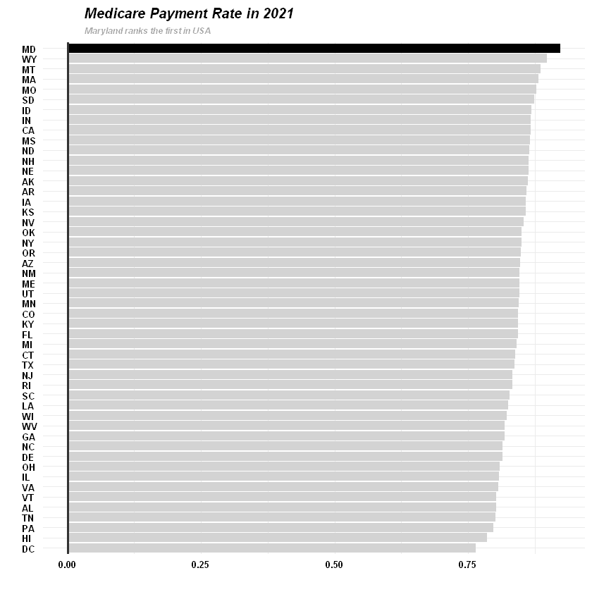

## CMS provider payment and coverage analysis

This project undertakes a comprehensive examination of variations in payments and coverage across different states, drawing on data from the [Centers for Medicare and Medicaid Services](https://data.cms.gov/provider-summary-by-type-of-service/medicare-inpatient-hospitals/medicare-inpatient-hospitals-by-provider). 

We have meticulously processed the Medicare Inpatient Hospitals data at the hospital level to analyze the statistical characteristics of payments, coverage, and their geographical distribution, using the R programming language.

Data dictionary: https://data.cms.gov/resources/medicare-inpatient-hospitals-by-provider-data-dictionary

## Key results

Maryland ranks the first for the Medicare payment rate.

