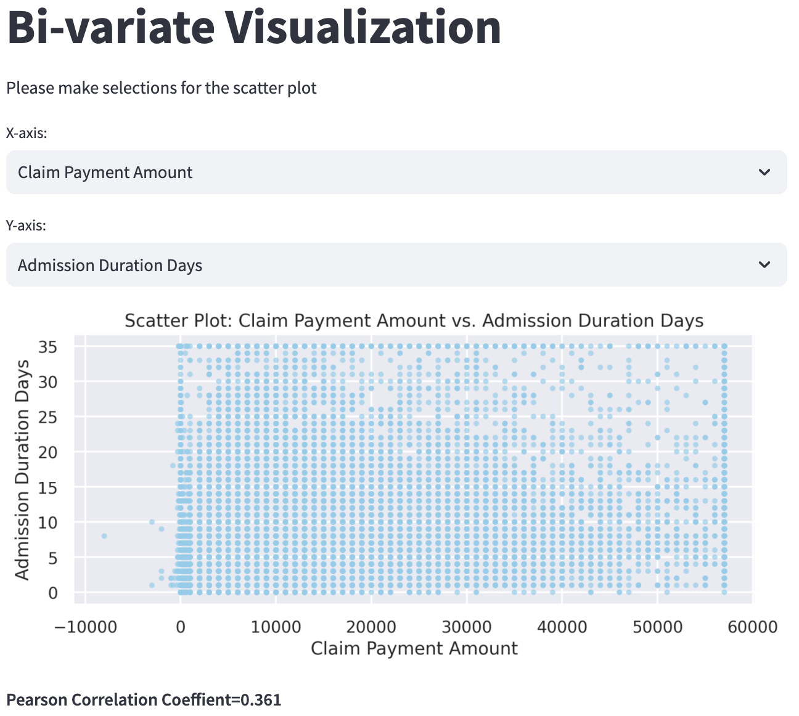
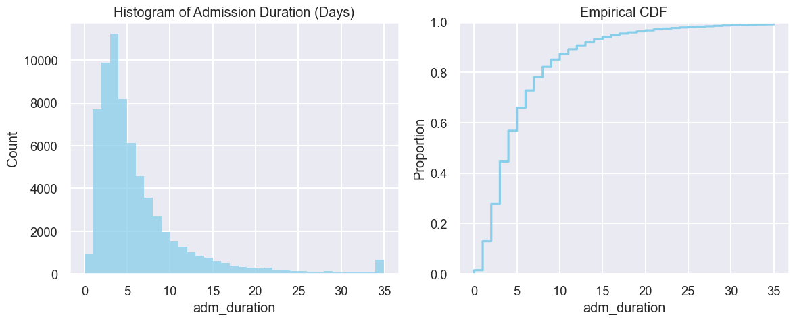
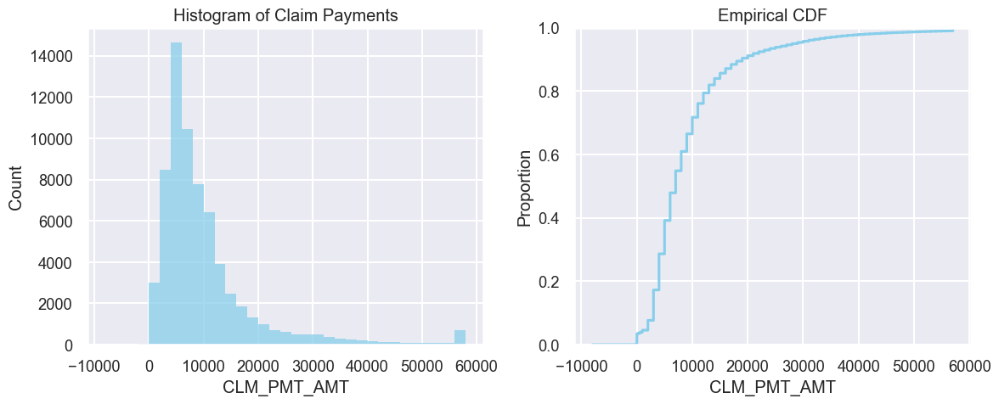

## CMS DE-SynPUF data analysis
The analysis utilizes the CMS 2008-2010 Data Entrepreneurs’ Synthetic Public Use File (DE-SynPUF). This dataset was crafted by the Centers for Medicare and Medicaid Services (CMS) to provide a means for individuals to familiarize themselves with Medicare claims data, all while ensuring the privacy of beneficiaries. This analysis focus on the medical costs. 

Reference: Codebook [link](https://www.cms.gov/files/document/de-10-codebook.pdf-0)

## Web Application ([link](http://3.80.234.121:8501/))
A Streamlit web application is serving on AWS EC2, try it out [here](http://3.80.234.121:8501/). 

Screenshot of the application:

    

## Key results from the analysis

- The distribution of admission duration exhibits a right-skewed pattern. The modal value for the duration stands at 4 days. Notably, approximately 90% of the admissions span less than two weeks.

    

- The claim payments distribution demonstrates a right-skewed shape. The most frequent payment amount is \\$4000-\\$6,000. Around 90% of the claims fall below the \\$20000 mark. 

    
