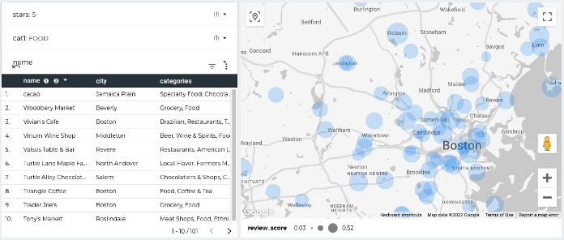

## Yelp Data Project: database, data processing, analytics, and ML models

This is an end-to-end project starting from building relational database, then conducting data processing and analysis, visualizing data with dashboard, and finally build machine learning models. The dataset was obtained from [Yelp](https://www.yelp.com/dataset). It has the following components:
- Relational database
- AWS cloud operation
- Data preprocessing/cleansing
- Exploratory data analysis
- NLP: SBERT embedding
- ML predictive models
- Dashboard

### Database

The raw Yelp dataset has a size of 9GB, including 150K business and ~7M customer reviews, etc. I created a relational database using AWS RDS for data storage and retrieving. The architecture for the database:

Tech stack:

### Dashboard
I build a Looker Studio dashboard ([link](https://lookerstudio.google.com/reporting/7a8a9eb5-bdde-4c8b-b015-44ffb0d7b2d1/page/p_q5tgnjxeuc)) to enable statistical analysis and geographical visualization. Screenshot:

### ML models
I extracted restaurant characteristics to predict whether a restaurant will still be open after two years. Specifically, we use a restaurant’s text and non-text features from the 2018 Yelp dataset to predict if the restaurant is still open until 2020. Unlike previous successful prediction studies, we made text features more valuable by using an noval NLP method--SBERT embedding. Various predictive models are used in this study.